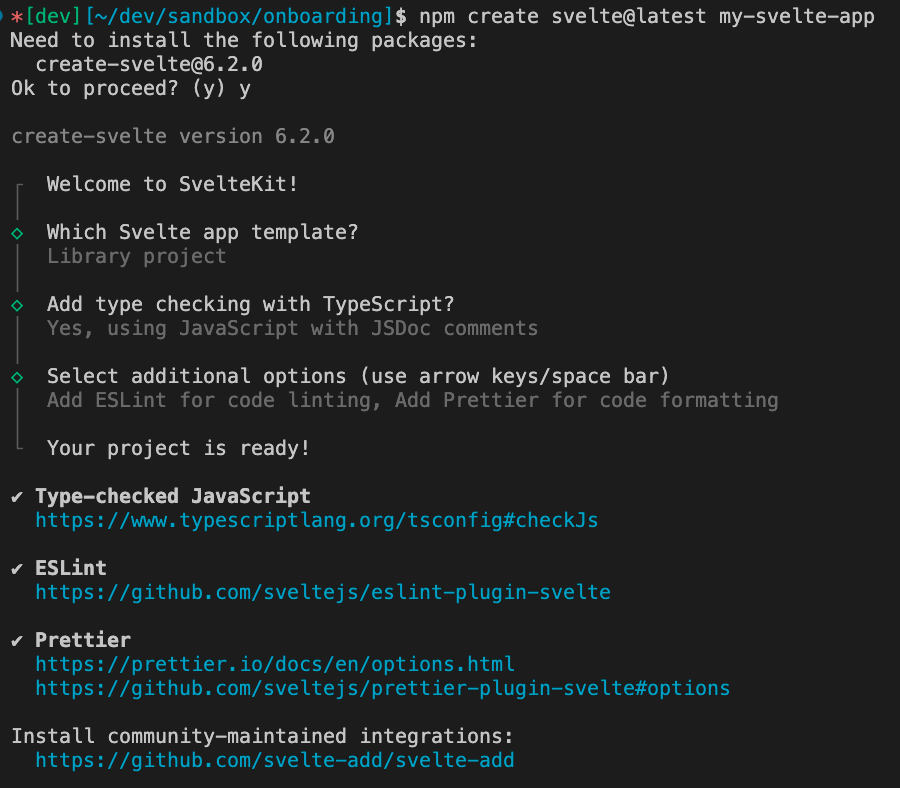

[home](./../README.md)
# Startup

Ran:
```sh
npm create svelte@latest my-svelte-app
```

And chose 'library' w/ JS:



See [here](./svelte-readme.md) for the generated svelte readme.

# Environment

I needed to install the latest node and n (node manager):

```sh
npm install -g n
sudo n latest
nvm use node
```