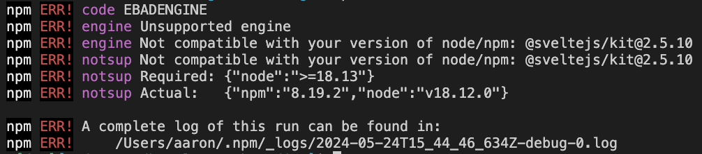

[home](./../README.md)
# Building

This project is meant to sit alongside [the onboarding-backend server project](https://github.com/aaronp/onboarding-backend).


The idea is that both (the frontend and backend) evolve in tandem. 

We do that by running `sbt "project appJS" ~fastLinkJS` from [the onboarding-backend](https://github.com/aaronp/onboarding-backend) 
and link to the generated output from this project using:


```sh
cd ../onboarding-backend/js/target/scala-3.4.1/app-fastopt
npm link
```

And then link from this project:
```sh
npm link main
```

Note: if npm reminds you that it sucks (e.g. the following):



...then you'll have to do this:

```sh
sudo n latest
nvm use node
```

# Using the service

At this point we can just do this:


```javascript
// Inside your Vite project
import { createService } from 'main';

// Use the function
var service = createService();
```

Which returns one of these badgers:

```scala
case class Services(handler: OnboardingImpl.InMemory, app: Onboarding.App)
```